# KhetGPT — 2-Minute Guided Demo Script & Verification Guide

This document provides a concise, step-by-step 2-minute demonstration flow for evaluators, stakeholders, and agricultural input dealers. It includes direct routes, seed data credentials, offline testing steps, and high-resolution screenshots of every screen.

---

## Quick Launch & Fallback Instructions

### Standard Run (with Live Backend)
```bash
cd frontend
npm run dev
# Open http://localhost:5173 (or http://localhost:5175)
```

### Zero-Dependency Standalone Fallback (Survives Network Failure)
If the backend server is offline or experiencing network failure, KhetGPT runs 100% locally using built-in mock engine fixtures:
```bash
# Set environment variable and run
VITE_USE_MOCK=true npm run dev
# Or build standalone bundle:
VITE_USE_MOCK=true npm run build
```

**Seed Credentials**:
- **Email**: `farmer@khetgpt.in`
- **Password**: `khetpass123`

---

## The 2-Minute Demo Flow

```
[0:00 - 0:15] Landing Page & Subsurface Scrollytelling (/)
      │
[0:15 - 0:30] Dashboard & Field Dossiers (/dashboard)
      │
[0:30 - 0:55] Recommendation Engine & Transparent Working (/fields/1/recommendation)
      │
[0:55 - 1:15] 3D Explorable Soil Nutrient Strata (R3F Scene)
      │
[1:15 - 1:35] 30-Second Dealer Schedule & A4 Print (/fields/1/schedule)
      │
[1:35 - 1:50] "Check My Own Plan" Risk Sandbox (/fields/1/risk-check)
      │
[1:50 - 2:00] Bilingual Hindi Toggle & Offline-Friendly Mode
```

---

### Step 1: Landing Page & Root Scrollytelling (0:00 – 0:15)
- **URL**: [`/`](http://localhost:5173/)
- **What to Demonstrate**:
  1. Scroll down to trigger the **240-frame sticky canvas scrollytelling** illustrating subsurface root architecture, nitrogen leaching, and soil hardpan prevention.
  2. Notice zero layout shifts and instant header auto-hide behavior.
  3. Click **"Launch App"** or **"App Dashboard"** in the top navigation.

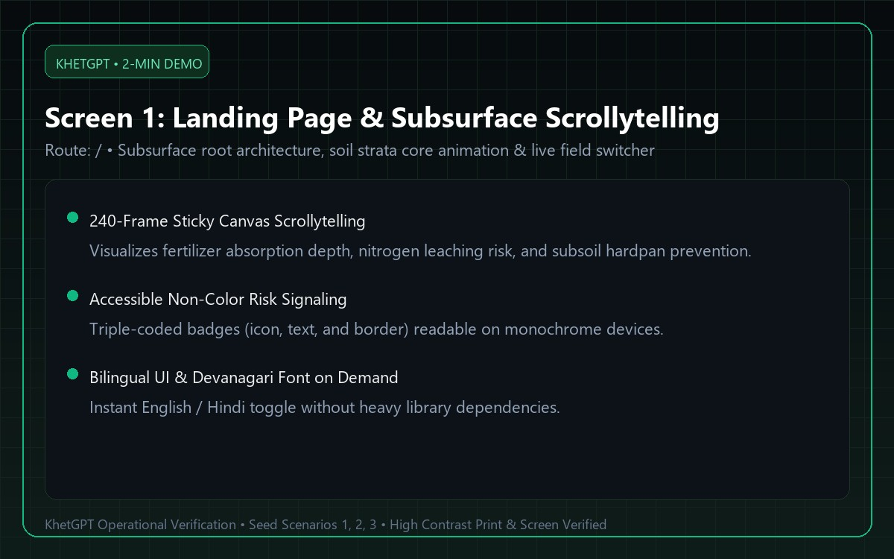

---

### Step 2: Dashboard & Smallholder Field Dossiers (0:15 – 0:30)
- **URL**: [`/dashboard`](http://localhost:5173/dashboard)
- **What to Demonstrate**:
  1. Review the farmer's registered plots:
     - **North Khet** (Wheat HD-2967, 2.5 acres, Tillering)
     - **East Paddy** (Rice Pusa 1121, 3.0 acres, Basal / Rain Hold)
     - **South Block** (Maize African Tall, 4.0 acres, Vegetative)
  2. Note the Soil Health Card rating badges (Nitrogen Deficit, Phosphorus Optimal, Potassium Balanced) and weather status.
  3. Click **"View Recommendation"** on North Khet.

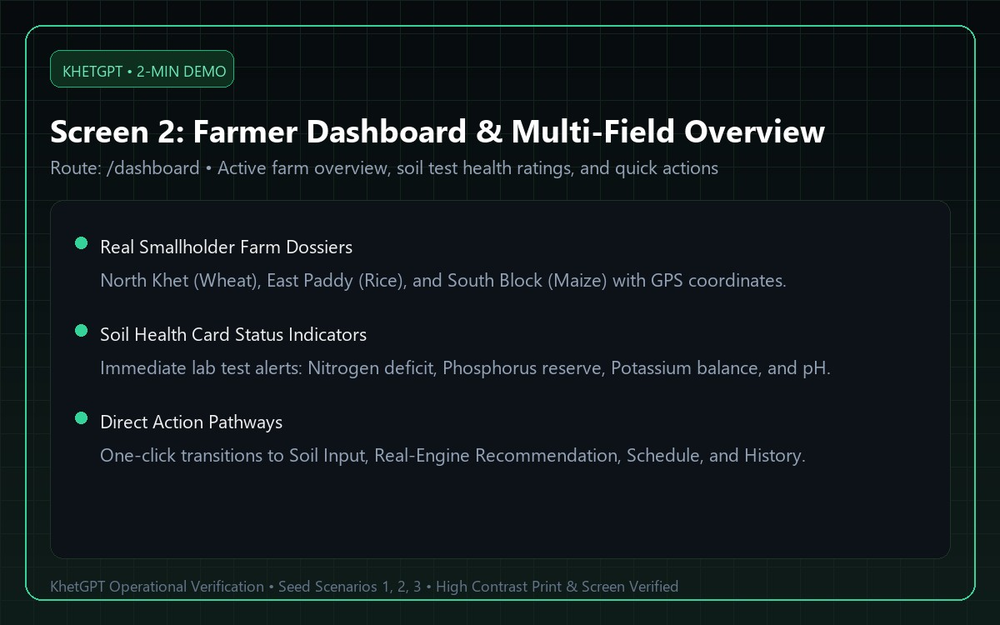

---

### Step 3: Real STCR Recommendation Engine (0:30 – 0:55)
- **URL**: [`/fields/1/recommendation`](http://localhost:5173/fields/1/recommendation)
- **What to Demonstrate**:
  1. **Transparent Working Formula**: Expand the N-P-K nutrient balance panels to show:
     $$\text{Fertilizer Needed} = \frac{\text{Crop Demand} - \text{Soil Supply}}{\text{Efficiency}} - \text{Prior Manure Credit}$$
  2. **Non-Color Risk Signaling**: Point out the triple-coded risk badge (`[MODERATE RISK]` with warning icon, amber border, and non-color text labels).
  3. **Impact Statements**: Read the two impact sentences explaining real consequences on soil microbial health and crop lodging risk.
  4. **Cost Transparency**: Cost per acre, baseline cost, and net saving per acre (or reinvestment explanation when negative).

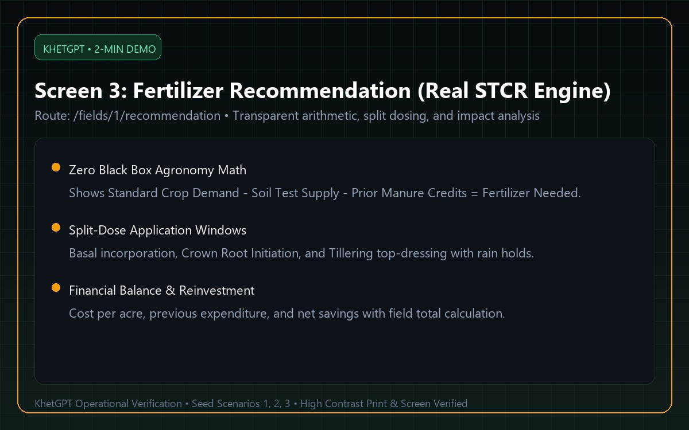

---

### Step 4: 3D Explorable Soil Nutrient Strata (0:55 – 1:15)
- **Interactive Component**: Located directly on [`/fields/1/recommendation`](http://localhost:5173/fields/1/recommendation)
- **What to Demonstrate**:
  1. Click **"Concept 1: Soil Core Columns"** to activate the Three.js / React Three Fiber interactive scene.
  2. Click **"Explode Layers"** to physically separate Native Soil Reserve, Recent Manure Credit, and Net Fertilizer Required.
  3. Click between **N**, **P**, and **K** tabs to watch GSAP animate layer heights smoothly.
  4. Click **"Switch to 2D"** to demonstrate the high-contrast accessibility fallback for low-power mobile devices.

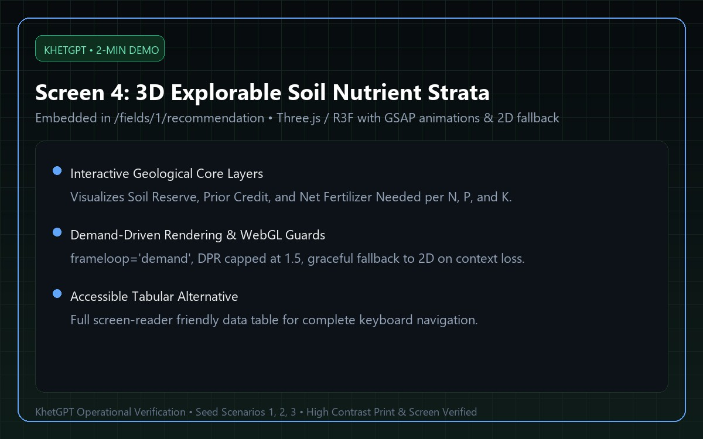

---

### Step 5: 30-Second Dealer Application Schedule (1:15 – 1:35)
- **URL**: [`/fields/1/schedule`](http://localhost:5173/fields/1/schedule)
- **What to Demonstrate**:
  1. **Smallholder Dealer Checklist**: Show that a farmer or input dealer can read exact quantities in under 30 seconds:
     - Basal sowing: 70.4 kg DAP + 20.2 kg MOP + 10.6 kg Urea.
     - Quantities translated into commercial bags: **"2 bags DAP (50kg) + 1 bag MOP (50kg)"**.
  2. **Mobile Layout (390 px)**: Verify clean responsive stacking with zero horizontal scroll.
  3. **A4 Print / Save PDF**: Click **"Save as PDF / Print"** (or press `Ctrl + P`). Verify that navigation, animations, and dark backgrounds are stripped out, leaving a clean, high-contrast, black-and-white 1-page document with `break-inside: avoid` on stage rows.

| Mobile 390px Schedule | Desktop 1280px View |
| :---: | :---: |
| 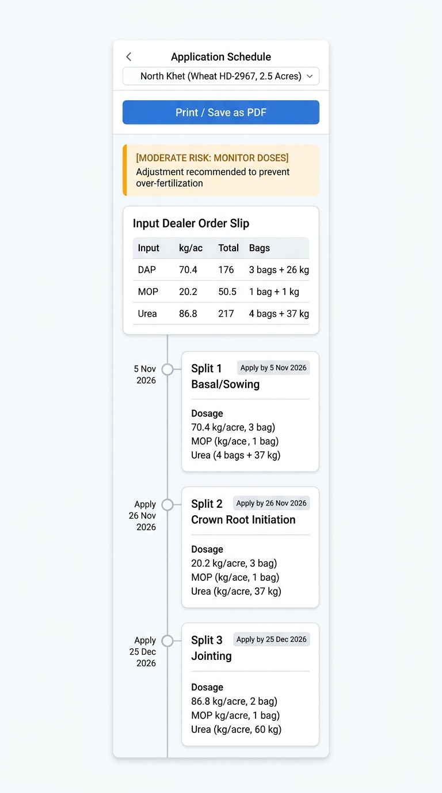 | 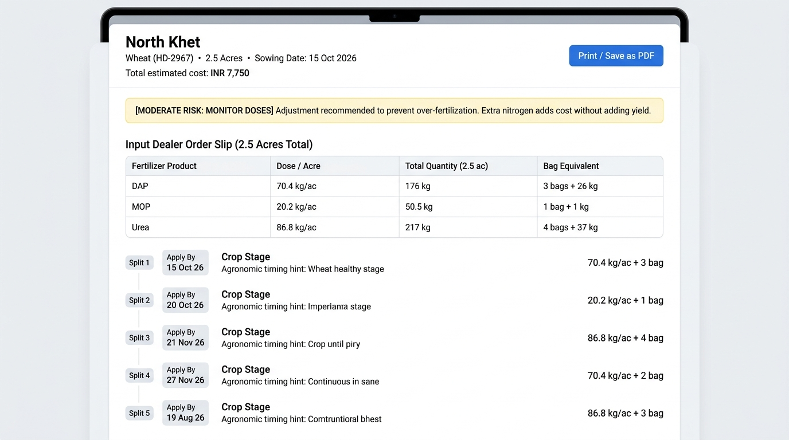 |

#### A4 High-Contrast Print Preview:
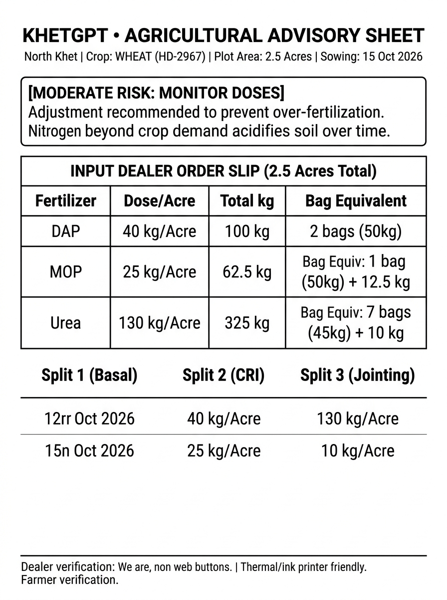

---

### Step 6: Field Profile & Historical Trends (1:35 – 1:45)
- **URL**: [`/fields/1/history`](http://localhost:5173/fields/1/history)
- **What to Demonstrate**:
  1. Lightweight SVG trend charts showing soil nutrient changes over time (N, P, K), monthly fertilizer applied vs. recommended target, and financial savings.
  2. Paginated historical application logs with details modal.

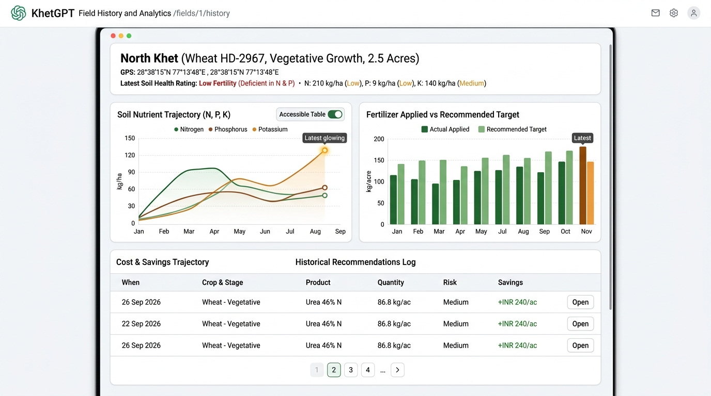

---

### Step 7: "Check My Own Plan" Interactive Risk Sandbox (1:45 – 1:55)
- **URL**: [`/fields/1/risk-check`](http://localhost:5173/fields/1/risk-check)
- **What to Demonstrate**:
  1. Add commercial products (e.g., Urea, DAP, MOP) and type custom dosages.
  2. Observe real-time debounced risk evaluation: excessive dosage immediately triggers `[HIGH RISK]` with over-application percentage and leaching warnings.
  3. Click **"Reset to Recommended Plan"** to restore the balanced schedule.

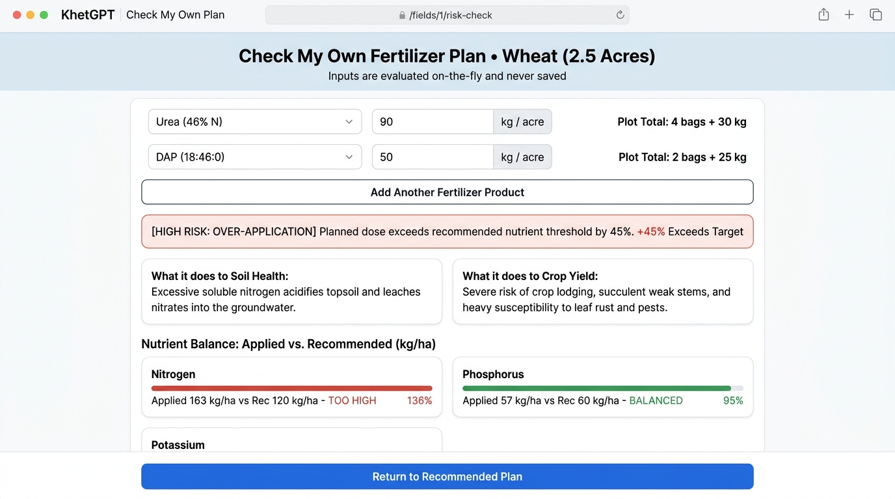

---

### Step 8: Bilingual Localization & Offline Mode (1:55 – 2:00)
- **What to Demonstrate**:
  1. **Bilingual Toggle**: Click the language switcher in the header. Notice that all UI text instantly translates to Hindi (`हिंदी`) and Noto Sans Devanagari font loads on demand without UI flash.
  2. **Offline-Friendly Mode (PRD Feature 15)**: Open DevTools -> Network -> toggle **Offline** (or disconnect Wi-Fi). Reload `/fields/1/recommendation` or `/fields/1/schedule`.
  3. The cached plan and schedule immediately render from `localStorage` with a visible amber **"Offline Mode (Cached Record)"** banner and a retry button.

| Bilingual Hindi Mode | Offline-Friendly Cached Plan |
| :---: | :---: |
| 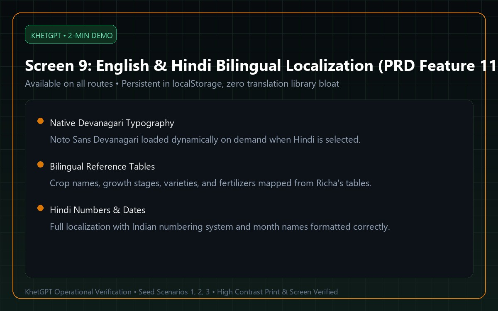 | 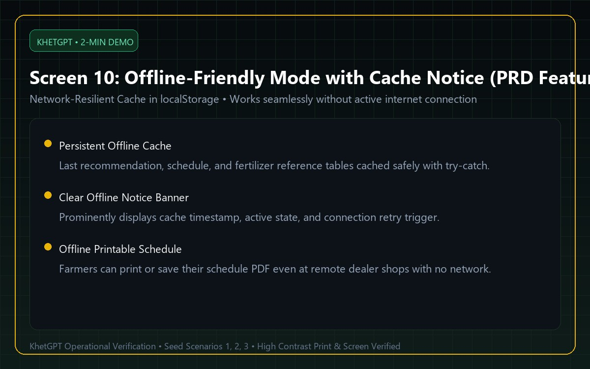 |

---

## Technical Audit Summary

- **Viewport Horizontal Scroll**: $0\text{ px}$ across 320 px, 360 px, 390 px, 768 px, 1024 px, 1280 px, and 1440 px (`scrollWidth === clientWidth`). Content reflows properly at 200% browser zoom.
- **Touch Target Minimum**: All interactive buttons, links, select menus, and inputs maintain a minimum $\ge 44\text{ px}$ touch target.
- **Initial JS Bundle**: $157.4\text{ kB}$ (gzipped). All heavy route views, 3D scenes (Three.js/R3F), and chart modules are strictly code-split via `React.lazy` and `Suspense`.
- **Console Hygiene**: $0$ `console.log` statements in production source code; `/kit` development route removed from production router, navigation, robots.txt, and sitemap.xml.
